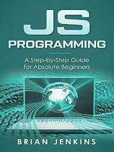

# deeksha1S.github.io
<!DOCTYPE html>
<html lang="en">

<head>
  <meta charset="utf-8">
  <meta content="width=device-width, initial-scale=1.0" name="viewport">

  <title>Personal Bootstrap Template</title>
  <meta content="" name="description">
  <meta content="" name="keywords">

  <!-- Favicons -->
  <link href="assets/img/favicon.png" rel="icon">
  <link href="assets/img/apple-touch-icon.png" rel="apple-touch-icon">

  <!-- Google Fonts -->
  <link href="https://fonts.googleapis.com/css?family=Open+Sans:300,300i,400,400i,600,600i,700,700i|Raleway:300,300i,400,400i,500,500i,600,600i,700,700i|Poppins:300,300i,400,400i,500,500i,600,600i,700,700i" rel="stylesheet">

  <!-- Vendor CSS Files -->
  <link href="assets/vendor/bootstrap/css/bootstrap.min.css" rel="stylesheet">
  <link href="assets/vendor/bootstrap-icons/bootstrap-icons.css" rel="stylesheet">
  <link href="assets/vendor/boxicons/css/boxicons.min.css" rel="stylesheet">
  <link href="assets/vendor/glightbox/css/glightbox.min.css" rel="stylesheet">
  <link href="assets/vendor/remixicon/remixicon.css" rel="stylesheet">
  <link href="assets/vendor/swiper/swiper-bundle.min.css" rel="stylesheet">

  <!-- Template Main CSS File -->
  <link href="assets/css/style.css" rel="stylesheet">

  <!-- =======================================================
  * Template Name: Personal - v4.9.1
  * Template URL: https://bootstrapmade.com/personal-free-resume-bootstrap-template/
  * Author: BootstrapMade.com
  * License: https://bootstrapmade.com/license/
  ======================================================== -->
</head>

<body>

  <!-- ======= Header ======= -->
  <header id="header">
    

      <h1><a href="index.html">Deeksha.S</a></h1>
      <!-- Uncomment below if you prefer to use an image logo -->
      <!--  -->
      <h2>I am a third year Computer Science & engineering student  studying in REVA University. </h2>

      <nav id="navbar" class="navbar">
        <ul>
          <li><a class="nav-link active" href="#header">Home</a></li>
          <li><a class="nav-link" href="#about">About</a></li>
          <li><a class="nav-link" href="#resume">Resume</a></li>
          <li><a class="nav-link" href="#gallery">Gallery</a></li>
          <li><a class="nav-link" href="#contact">Contact</a></li>
        </ul>
        <i class="bi bi-list mobile-nav-toggle"></i>
      </nav><!-- .navbar -->

      

    

  </header><!-- End Header -->

  <!-- ======= About Section ======= -->
  <section id="about" class="about">

    <!-- ======= About Me ======= -->
    

      

        <h2>About</h2>
        
About me

      

      

        

          
        

        

          <h3>Details & Education</h3>
          

            The Graphic Designer job description includes the entire process of defining requirements, visualizing and creating graphics including illustrations.
          

          

            

              <ul>
                <li><i class="bi bi-chevron-right"></i> <strong>Birthday:</strong> 1 July 2002</li>
                <li><i class="bi bi-chevron-right"></i> <strong>SRN:</strong> R20EF029</li>
                <li><i class="bi bi-chevron-right"></i> <strong>Phone:</strong> 9482699499</li>
                <li><i class="bi bi-chevron-right"></i> <strong>City:</strong> Bangalore,Karnataka,India</li>
              </ul>
            

            

              <ul>
                <li><i class="bi bi-chevron-right"></i> <strong>Parents:</strong> ShashiKumar.G,Vijayalakshmi.S</li>
                <li><i class="bi bi-chevron-right"></i> <strong>Degree:</strong> B.tech</li>
                <li><i class="bi bi-chevron-right"></i> <strong>PhEmailone:</strong> deeks1shashi@gmail.com</li>
                
              </ul>
            

          

          

            
          

        

      

    
<!-- End About Me -->

    <!-- ======= Counts ======= -->
    

      

        

        

          

            <i class="bi bi-journal-richtext"></i>
            
            
Projects

          

        

       

      

    
<!-- End Counts -->

    <!-- ======= Skills  ======= -->
    

      

        <h2>Skills</h2>
      

      

        

          

            HTML <i class="val">100%</i>
            

              

            

          

          

            CSS <i class="val">90%</i>
            

              

            

          

          

            JavaScript <i class="val">75%</i>
            

              

            

          

        

        

          

            Python <i class="val">80%</i>
            

              

            

          

          

            Web Technologies <i class="val">60%</i>
            

              

            

          

          

            Photoshop <i class="val">55%</i>
            

              

            

          

        

      

    
<!-- End Skills -->

    <!-- ======= Interests ======= -->
    

      

        <h2>Interests</h2>
      

      

        

          

            <i class="ri-store-line" style="color: #ffbb2c;"></i>
            <h3>Designing</h3>
          

        

        

          

            <i class="ri-bar-chart-box-line" style="color: #5578ff;"></i>
            <h3>Singing</h3>
          

        

        

          

            <i class="ri-calendar-todo-line" style="color: #e80368;"></i>
            <h3>writing</h3>
          

        

        

          

            <i class="ri-paint-brush-line" style="color: #e361ff;"></i>
            <h3>listening to songs</h3>
          

        

       
        

          

            <i class="ri-gradienter-line" style="color: #ffa76e;"></i>
            <h3>editing</h3>
          

        

       
        

          

            <i class="ri-anchor-line" style="color: #b2904f;"></i>
            <h3>Photoshop</h3>
          

        

        
        

          

            <i class="ri-fingerprint-line" style="color: #29cc61;"></i>
            <h3>Andriod development</h3>
          

        

      

    
<!-- End Interests -->

    

  </section><!-- End About Section -->

  <!-- ======= Resume Section ======= -->
  <section id="resume" class="resume">
    

      

        <h2>Resume</h2>
        
Check My Resume

      

      

        

          <h3 class="resume-title">Sumary</h3>
          

            <h4>Deeksha.S</h4>
            
<em>Innovative and deadline-driven Graphic Designer with no experience in designing.</em>

            

            <ul>
              <li>R20EF029</li>
              <li>161,Rajajinagar,Bangalore-560010,India</li>
              <li>9482699499</li>
              <li>deeks1shashi@gmail.com</li>
            </ul>
            

          

          <h3 class="resume-title">Education</h3>
          

            <h4>Bachelor of technology in Computer Science & Engineering</h4>
            <h5>2020 - 2024</h5>
            
<em>REVA University,Bangalore</em>

            

          

          

            <h4>Pre-University</h4>
            <h5>2018 - 2020</h5>
            
<em>Base PU college,Shivanagar,Bangalore</em>

            

            <h4> High School</h4>
            <h5>2006-2018</h5>
            
<em>VVS Sadar Patel High School,Rajajinagar,Bangalore</em>

           

        

        

          <h3 class="resume-title">Skills</h3>
          

            <h4>Adjustable(flexible)</h4>
            <h5>Team Worker,Organizing</h5>
            
<em> </em>

            

            
            

          

          

            <h4>Listening</h4>
            <h5>Attention to detail,Time management</h5>
            

            

            
            

                 
         
           
          

          <h3 class="resume-title">Projects</h3>
          

            <h4>Internet of things(IOT)</h4>
            <h5>Women Safety Ring</h5>
            
<em> </em>

            

        

      

    

  </section><!-- End Resume Section -->

  <!-- ======= Gallery Section ======= -->
  <section id="gallery" class="gallery">
    

      

        <h2>gallery</h2>
        
      

     

      

        

          

            
            

              <h4> </h4>
              
Computer Networks

              

                <a href="assets/img/portfolio/portfolio-1.jpg" data-gallery="portfolioGallery" class="portfolio-lightbox" title="App 1"><i class="bx bx-plus"></i></a>
                <a href="portfolio-details.html" data-gallery="portfolioDetailsGallery" data-glightbox="type: external" class="portfolio-details-lightbox" title="Portfolio Details"><i class="bx bx-link"></i></a>
              

            

          

        

        

          

            
            

              <h4></h4>
              
Basic of C language

              

                <a href="assets/img/portfolio/portfolio-2.jpg" data-gallery="portfolioGallery" class="portfolio-lightbox" title="Web 3"><i class="bx bx-plus"></i></a>
                <a href="portfolio-details.html" data-gallery="portfolioDetailsGallery" data-glightbox="type: external" class="portfolio-details-lightbox" title="Portfolio Details"><i class="bx bx-link"></i></a>
              

            

          

        

        

          

            
            

              <h4> </h4>
              
Data structure

              

                <a href="assets/img/portfolio/portfolio-3.jpg" data-gallery="portfolioGallery" class="portfolio-lightbox" title="App 2"><i class="bx bx-plus"></i></a>
                <a href="portfolio-details.html" data-gallery="portfolioDetailsGallery" data-glightbox="type: external" class="portfolio-details-lightbox" title="Portfolio Details"><i class="bx bx-link"></i></a>
              

            

          

        

        

          

            
            

              <h4></h4>
              
Deep learning

              

                <a href="assets/img/portfolio/portfolio-4.jpg" data-gallery="portfolioGallery" class="portfolio-lightbox" title="Card 2"><i class="bx bx-plus"></i></a>
                <a href="portfolio-details.html" data-gallery="portfolioDetailsGallery" data-glightbox="type: external" class="portfolio-details-lightbox" title="Portfolio Details"><i class="bx bx-link"></i></a>
              

            

          

        

        

          

            
            

              <h4></h4>
              
JavaScript

              

                <a href="assets/img/portfolio/portfolio-5.jpg" data-gallery="portfolioGallery" class="portfolio-lightbox" title="Web 2"><i class="bx bx-plus"></i></a>
                <a href="portfolio-details.html" data-gallery="portfolioDetailsGallery" data-glightbox="type: external" class="portfolio-details-lightbox" title="Portfolio Details"><i class="bx bx-link"></i></a>
              

            

          

        

        

          

            
            

              <h4></h4>
              
MachineLearning

              

                <a href="assets/img/portfolio/portfolio-6.jpg" data-gallery="portfolioGallery" class="portfolio-lightbox" title="App 3"><i class="bx bx-plus"></i></a>
                <a href="portfolio-details.html" data-gallery="portfolioDetailsGallery" data-glightbox="type: external" class="portfolio-details-lightbox" title="Portfolio Details"><i class="bx bx-link"></i></a>
              

            

          

        

        

          

            
            

              <h4></h4>
              
MongoDB

              

                <a href="assets/img/portfolio/portfolio-7.jpg" data-gallery="portfolioGallery" class="portfolio-lightbox" title="Card 1"><i class="bx bx-plus"></i></a>
                <a href="portfolio-details.html" data-gallery="portfolioDetailsGallery" data-glightbox="type: external" class="portfolio-details-lightbox" title="Portfolio Details"><i class="bx bx-link"></i></a>
              

            

          

        

        

          

            
            

              <h4></h4>
              
Python

              

                <a href="assets/img/portfolio/portfolio-8.jpg" data-gallery="portfolioGallery" class="portfolio-lightbox" title="Card 3"><i class="bx bx-plus"></i></a>
                <a href="portfolio-details.html" data-gallery="portfolioDetailsGallery" data-glightbox="type: external" class="portfolio-details-lightbox" title="Portfolio Details"><i class="bx bx-link"></i></a>
              

            

          

        

        

          

            
            

              <h4></h4>
              
WebTechnology

              

                <a href="assets/img/portfolio/portfolio-9.jpg" data-gallery="portfolioGallery" class="portfolio-lightbox" title="Web 3"><i class="bx bx-plus"></i></a>
                <a href="portfolio-details.html" data-gallery="portfolioDetailsGallery" data-glightbox="type: external" class="portfolio-details-lightbox" title="Portfolio Details"><i class="bx bx-link"></i></a>
              

            

          

        

      

    

  </section><!-- End Portfolio Section -->

  <!-- ======= Contact Section ======= -->
  <section id="contact" class="contact">
    

      

        <h2>Contact</h2>
        
Contact Me

      

      

        

          

            <i class="bx bx-map"></i>
            <h3>My Address</h3>
            
161,48th cross,Rajajinagar,Bangalore-560010,India

          

        

       

        

          

            <i class="bx bx-envelope"></i>
            <h3>Email Me</h3>
            
deeks1shashi@gmail.com

          

        

        

          

            <i class="bx bx-phone-call"></i>
            <h3>Call Me</h3>
            
9482699499

          

        

      

      <form action="forms/contact.php" method="post" role="form" class="php-email-form mt-4">
        

          

            <input type="text" name="name" class="form-control" id="name" placeholder="Your Name" required>
          

          

            <input type="email" class="form-control" name="email" id="email" placeholder="Your Email" required>
          

        

        

          <input type="text" class="form-control" name="subject" id="subject" placeholder="Subject" required>
        

        

          <textarea class="form-control" name="message" rows="5" placeholder="Message" required></textarea>
        

        

          
Loading

          

          
Your message has been sent. Thank you!

        

        
<button type="submit">Send Message</button>

      </form>

    

  </section><!-- End Contact Section -->

  

    <!-- All the links in the footer should remain intact. -->
    <!-- You can delete the links only if you purchased the pro version. -->
    <!-- Licensing information: https://bootstrapmade.com/license/ -->
    <!-- Purchase the pro version with working PHP/AJAX contact form: https://bootstrapmade.com/personal-free-resume-bootstrap-template/ -->
    Designed by <a href="https://bootstrapmade.com/">BootstrapMade</a>
  

  <!-- Vendor JS Files -->
  
  
  
  
  
  
  

  <!-- Template Main JS File -->
  

</body>

</html>
